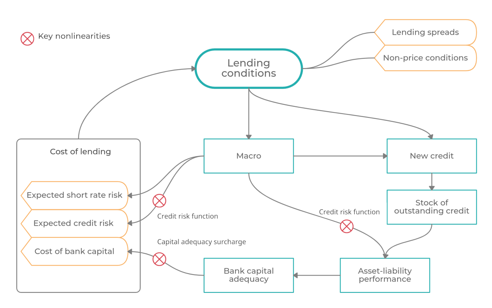

# :fontawesome-solid-cube:  Macrofinancial stability model

GIMM has developed an in-house modeling framework designed for medium-term dynamic macro-financial analysis, complete with two-way macro-financial interactions, key nonlinearities, and a range of possible macroprudential policies. The framework is build on insights from large-scale DSGE models, such as the [MAPMOD](https://www.imf.org/en/Publications/WP/Issues/2016/12/31/Financial-Crises-in-DSGE-Models-Selected-Applications-of-MAPMOD-41466), but great care has been placed on keeping the framework simple, flexible, and operable. The framework consists of several modules that can be added, removed, or modified as needed. 

The framework includes several nonlinearities which are essential for macroprudential modeling and analysis of macroprudential policy. The framework is therefore able to simulate a wide range of macroprudential policy interventions and allows not only for theoretical, shock-minus-control simulations starting from equilibrium, but also allows us to build simulations based on the current state of the economy and macroeconomic forecast. 

**Use cases:**

* Conceptual simulations, in particular policy interventions simulations, to recive insights as to how a particular policy impacts the financial sector and macroeconomy.
* Data-based projections, scenarios consistent with macroeconomic assumptions (e.g. central bank macro forecast) and the current state of the financial sector.
* Shock-minus-control scenarios, built on top of a baseline: consistent picture of shock impact on the macroeconomy and financial sector, taking into account the current state of the financial sector.
* Steady state analysis (comparative static) to understand how changes in structural features (parameters) impact the economy and the transition between the two states.

The framework is continually developed and updated.
